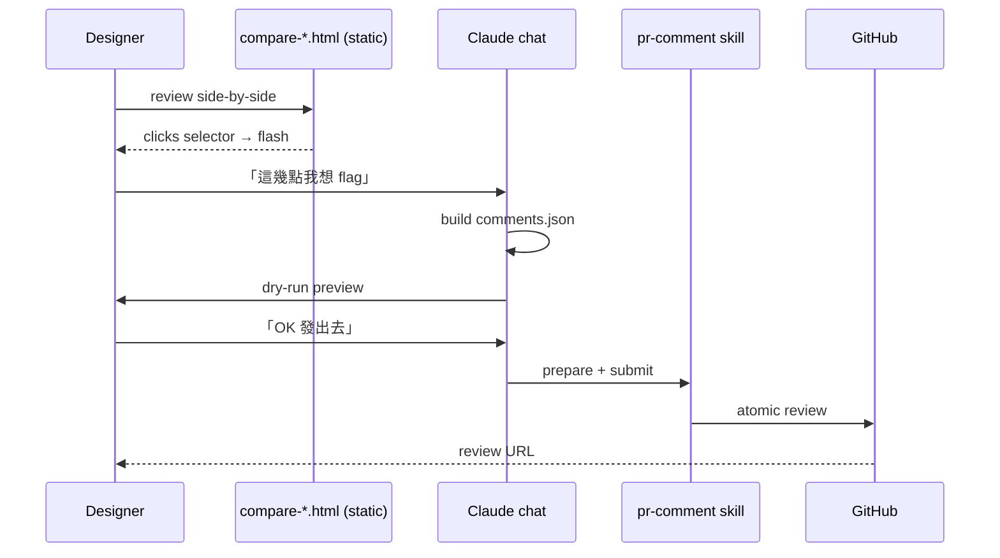
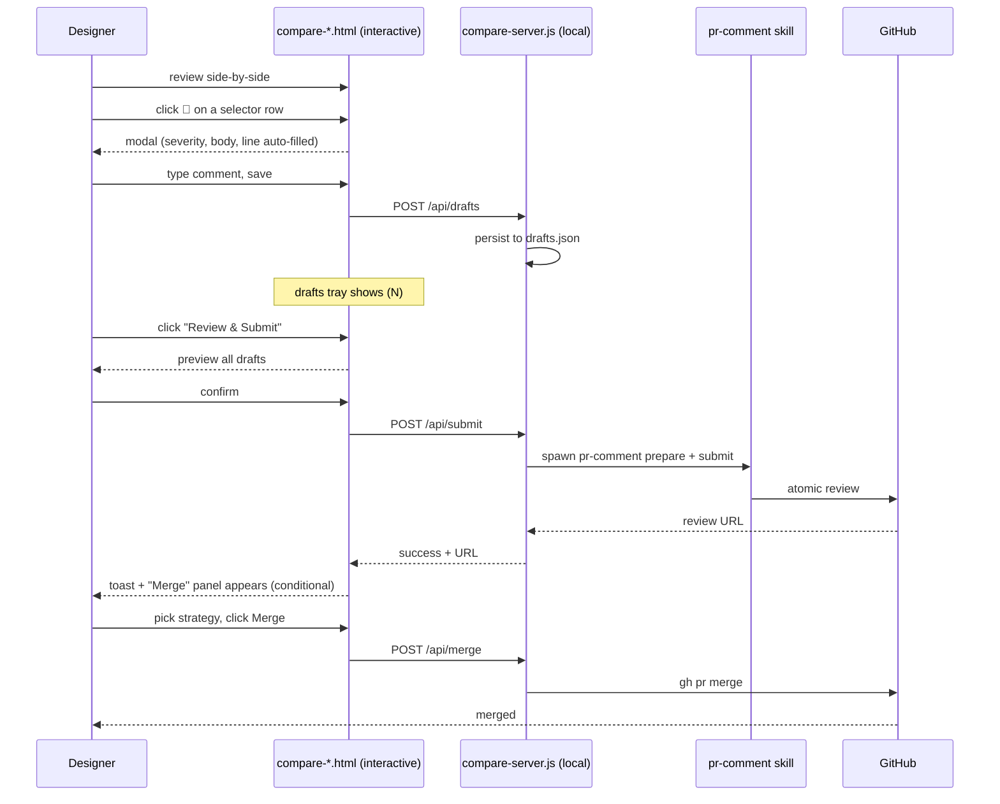

# PLAN — Inline Comment + Merge in design-pr-review UI

> Exploration only. Nothing implemented yet. Status: draft for Karen's review.
> Author: Claude (assistant). Date: 2026-05-19.

## Goal

Right now `compare-<cluster>.html` is a read-only viewer. After review, the designer has to leave the wrapper, go back to Claude chat, and confirm "OK 發出去" before `pr-comment` posts the review. This plan explores letting the designer **draft + submit comments — and optionally merge — directly from the wrapper UI**, without leaving the browser.

Two features in scope:
1. **Inline comment composer + atomic submit** (via existing `pr-comment` skill)
2. **Merge button** (via `gh pr merge`)

## Current state



Gap: the wrapper has the diff context (selector, line, snippet) — but the comment authoring happens in chat, where the designer has lost visual reference. Click-back-and-forth.

## Target UX



Designer never leaves browser. Claude chat still owns the rubric walk (Stage 3c — questions one at a time) but **comment authoring + submit + merge moves into the UI**.

## Architecture options

| Option | How | Pros | Cons | Verdict |
|---|---|---|---|---|
| **A. Replace `python3 -m http.server` with Node server** | `compare-server.js` serves static files + adds `/api/*` routes; spawns `pr-comment.js` as subprocess | Same origin (no CORS), reuses gh CLI auth, single process, one port | New dependency (Node already used by `compute-html-diff.js`, no real new dep), 100–150 LOC backend | ✅ **Recommended** |
| B. Keep Python static + separate Node API on different port | Wrapper makes `fetch()` to other port | Minimal change to current `serve-compare.sh` | CORS dance, two processes to manage, two ports to clean up | ❌ |
| C. Browser → GitHub API direct | Inject `gh auth token` into HTML at serve time, browser hits api.github.com | No backend changes | Token in HTML even localhost-only is risk; tone enforcement impossible; SHA-drift logic gets duplicated | ❌ |
| D. localStorage drafts + manual export to chat | Wrapper accumulates drafts → "Export JSON" button → designer pastes back to Claude | No backend at all | Breaks the "directly" goal; same friction as today | ❌ |
| E. WebSocket bridge to Claude Code session | Wrapper holds WS to running Claude session; Claude executes commands | Reuses Claude's existing auth/skill machinery | Heavy, fragile, Claude session has to be running, no clean lifecycle | ❌ |

## Recommended architecture (Option A)

```
~/.claude/skills/design-pr-review/scripts/
├── compare-server.js          [NEW] — Node http server, serves static + /api/*
├── serve-compare.sh           [MODIFY] — start compare-server.js instead of python http.server
├── make-compare-wrapper.js    [MODIFY] — inject draft tray + 💬 buttons + modal
├── pr-comment-bridge.js       [NEW] — thin wrapper that locates + spawns pr-comment.js
└── serve-stop.sh              [UNCHANGED]
```

**compare-server.js** responsibilities:
- Serve static files from `$WORKSPACE` (same as python http.server)
- `/api/*` routes (see contract below)
- Bind 127.0.0.1 only (same as today)
- Reuse port logic from existing `serve-compare.sh`

## API contract (Phase 1)

```
GET  /api/pr-meta              → { pr, repo, head_sha, mergeable, state, ... }
GET  /api/drafts               → [{ id, path, line, side, severity, body, ts }]
POST /api/drafts               body: { path, line, side, severity, body }    → { id }
PATCH /api/drafts/:id          body: partial                                  → ok
DELETE /api/drafts/:id                                                        → ok
POST /api/submit               body: { summary }                              → { reviewUrl } | { error, code }
POST /api/merge                body: { strategy: 'merge'|'squash'|'rebase' }  → { sha } | { error }
GET  /api/status               → { sha_drift: bool, drafts_count: n }
```

State persistence: `$WORKSPACE/drafts.json` (so refresh doesn't lose drafts).

## UI changes

### Inline 💬 button — every selector / violation row

Current row (rendered by `make-compare-wrapper.js`):
```html
<li><button class="anchor" data-line="42"><code>.btn-primary</code>...</button></li>
```

New row:
```html
<li class="anchor-row">
  <button class="anchor" data-line="42"><code>.btn-primary</code>...</button>
  <button class="add-comment" data-path="..." data-line="42" data-side="RIGHT">💬</button>
</li>
```

### Comment modal

- Pre-filled: `path`, `line`, `side` (from data attrs)
- Severity dropdown: 🔴 issue · 🟡 suggestion · 🟣 nitpick · ❓ question · 👍 praise
- Body textarea with placeholder showing tone-rule reminders: *"問句不下命令；主詞是 code 不是人；給原因"*
- Soft client-side warning if body matches `/(you should|must|wrong|錯了)/i` — non-blocking
- Save → POST /api/drafts → row gets 💬 badge with count

### Floating drafts tray (top-right)

- Pill: `📋 Drafts (3)` — clicking expands list
- Each draft: severity icon, path:line, first 60 chars, ✏️ edit / 🗑 delete
- Bottom: `[Review & Submit]` button

### Submit modal

- Top-level summary textarea (becomes PR review body)
- All drafts listed in posting order
- SHA freshness indicator (green ✓ or amber ⚠ "PR changed since drafts started")
- `[Cancel]` `[Submit Review]`
- After submit: toast with review URL + optionally show **Merge panel** (Phase 2)

### Merge panel (Phase 2)

- Conditional render: only if `pr-meta.mergeable === 'MERGEABLE'` AND designer has perm (check via `gh api repos/.../collaborators/<user>/permission`)
- Strategy dropdown — default to repo's allowed strategy (read from `gh api repos/.../`)
- Double-confirm dialog before POST
- Show CI status if checks defined

## pr-comment integration

`pr-comment.js` already accepts `prepare --pr N --repo X --input file.json` then `submit --workspace /tmp/...`. Integration approach:

```js
// compare-server.js → /api/submit handler (sketch)
const drafts = readJSON(`${workspace}/drafts.json`);
const commentsJsonPath = `${workspace}/comments.json`;
writeJSON(commentsJsonPath, { summary, comments: drafts });

// Locate pr-comment.js
const prCommentPath = resolvePrCommentScript(); // see bridge below
const prepare = await spawn('node', [prCommentPath, 'prepare',
  '--pr', pr, '--repo', repo, '--input', commentsJsonPath]);
if (prepare.exitCode !== 0) return res.status(500).json({error: prepare.stderr});

const submit = await spawn('node', [prCommentPath, 'submit',
  '--workspace', `${workspace}/.pr-comment-state`]);
// pr-comment.submit needs state from prepare; check actual flag names
```

**pr-comment-bridge.js** — locates the script across possible install paths:
```js
const candidates = [
  process.env.PR_COMMENT_PATH,
  expandHome('~/.claude/plugins/cache/sd0xdev-marketplace/sd0x-dev-flow/*/skills/pr-comment/scripts/pr-comment.js'),
  expandHome('~/.claude/plugins/marketplaces/sd0xdev-marketplace/skills/pr-comment/scripts/pr-comment.js'),
];
// glob, pick first existing, throw helpful error if none
```

**Why subprocess not require()**:
- `pr-comment.js` resolves `PLUGIN_ROOT` via walk-up — fragile to require from outside
- Subprocess isolates failures (UI stays responsive even if pr-comment crashes)
- pr-comment may upgrade independently; spawn-by-path tolerates that

**Alternative considered**: invoke skill via `claude-code --skill pr-comment ...` programmatically. Rejected because:
- No stable CLI shim for skills today
- Adds Claude session as dependency
- Subprocess is dead simple

## Merge button

`gh pr merge <N> --squash` (or `--merge` / `--rebase`).

Considerations:
- In trendlife-general/hie-rei, author usually merges. Reviewer merging is unusual. **Risk**: button invites merging before author has finished iterating.
- Mitigation: only render when `pr-meta.user.login === currentUser` OR designer has explicit admin scope
- Or: rename to "Approve & Merge" — separates "approve via review" from "merge" semantically

**Recommendation**: ship Phase 2, default-hidden behind a `?merge=1` query flag or a setting toggle. Get UX feedback first.

## Tone enforcement

UI can encourage but can't force. Layers:

| Layer | What | Effort |
|---|---|---|
| **Placeholder hints** | Modal textarea placeholder shows the 7 tone rules in shortened form | 5 min |
| **Soft regex warning** | Client checks for "should/must/wrong/錯了" and shows amber hint | 30 min |
| **LLM polish** | "Polish tone" button calls Claude API to rewrite | 2 hr + API cost |

Phase 1: placeholder + regex. LLM polish defer.

## Security

- Server binds 127.0.0.1 only (existing behavior preserved)
- No GitHub token in HTML — server uses local `gh` CLI auth
- No remote access path; rogue local process is the only attack surface (low risk on designer's machine)
- CORS: server sets `Access-Control-Allow-Origin: http://127.0.0.1:<port>` strictly
- Drafts persisted to local FS, deleted with `serve-stop.sh --purge`

## Workspace lifecycle

`$WORKSPACE/.server-pid` and `.server-port` already exist. Add:
- `$WORKSPACE/drafts.json` — current drafts (persisted across browser refresh)
- `$WORKSPACE/.pr-comment-state/` — pr-comment scratch when handed off

`serve-stop.sh` should optionally `--purge` drafts (default: keep, so designer can resume next session).

## Phasing

### Phase 1 — MVP (1 day)
- `compare-server.js` (Node http, ~150 LOC)
- Update `serve-compare.sh` to launch it (keep python as fallback)
- `pr-comment-bridge.js` (~40 LOC)
- UI: 💬 buttons, comment modal, drafts tray, submit modal
- Endpoints: pr-meta / drafts CRUD / submit
- No merge button yet

### Phase 2 — Merge + polish (half day)
- Merge panel conditional on permissions
- SHA-drift polling (every 30s)
- Tone regex warning
- Status toast improvements

### Phase 3 — Optional power-ups (1+ day each, prioritize by feedback)
- LLM tone polish button (Claude API)
- Dedup against existing reviewer threads via `load-pr-review`
- Multi-cluster draft tray (drafts persist across cluster switch)
- Playwright pixel-diff snapshot embedded in comment

## SKILL.md changes required

Stage 5 in `SKILL.md` today says:

> Write `comments.json` ... Invoke `sd0x-dev-flow:pr-comment` skill via bash `run-skill.sh`

After this change, Stage 5 splits into two paths:

- **UI path (new default)**: After Stage 3 walk, tell designer 「review 完直接在畫面右上 drafts tray 按 Submit。我這邊不再幫你 build comments.json。」
- **Chat path (legacy)**: keep current flow as fallback (e.g. designer prefers reviewing in chat, or server died)

The "Critical rules" + "Verification checklist" sections need re-words for UI path. **Never auto-post** principle still holds — submit only happens on explicit click.

## Risks

| Risk | Mitigation |
|---|---|
| pr-comment.js install path drift across machines | Bridge file with multi-candidate glob + env override |
| SHA drift between draft + submit (PR pushed new commits) | pr-comment already detects; UI surfaces it before submit |
| Designer fills draft, closes browser, loses work | Persist to `drafts.json` after every keystroke (debounced) |
| Server orphans (forgot to stop) | `serve-stop.sh` exists; add to skill verification checklist |
| Drafts written but submit fails midway → ghost state | pr-comment is atomic; drafts.json kept until submit success ack |
| Designer accidentally clicks Merge | Phase 2 only; double-confirm + perm check |
| Tone enforcement is opt-in not mandatory | Accept it — skill principle is "designer decides". UI nudges, doesn't gate. |

## Out of scope (explicitly)

- Replacing GitHub web UI for reading other people's comments → use `load-pr-review`
- Becoming a generic PR review tool → this stays designer-focused (HTML+MD+CSS)
- Posting comments to non-trendlife repos → server doesn't restrict but skill is shaped around design repos

## Open questions for Karen

1. **Merge button — ship in Phase 1 or Phase 2?** I lean Phase 2 (UX risk of premature merge). Your call.
2. **Tone polish via Claude API — would you actually use it?** If yes, Phase 1; if "nice but rarely" → Phase 3.
3. **Default flow** — once UI submit works, should chat-based "OK 發出去" be removed entirely, or kept as fallback? Removing simplifies SKILL.md but loses flexibility.
4. **Drafts retention** — keep drafts forever (per workspace) or auto-delete on submit? I'd auto-delete on success but keep on failure.
5. **Merge button conditional** — gate by author = reviewer, by repo permission, or by explicit toggle?

## Effort summary

| Phase | Lines added | Time |
|---|---|---|
| Phase 1 | ~350 (server 150 + UI 120 + bridge 40 + tests 40) | 1 day |
| Phase 2 | ~150 | half day |
| Phase 3 | varies per power-up | 1+ day each |

**Total to "designer never leaves browser"**: ~1.5 days of focused work.
